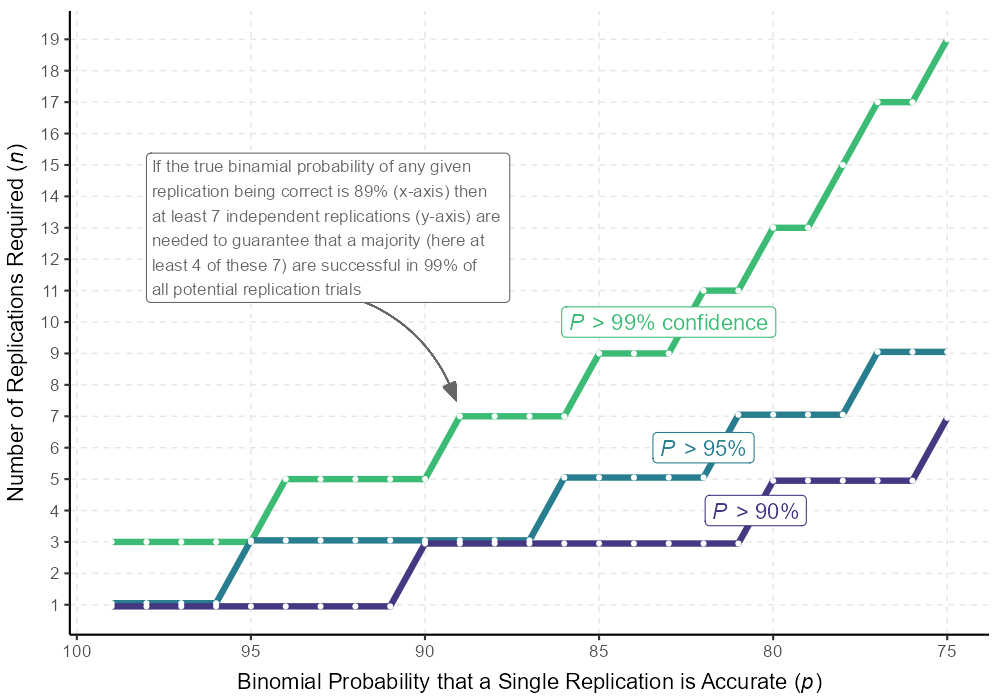

```{r setup}
rm(list = ls())
library(pacman)


pacman::p_load("dplyr", "readr", "lattice", "tidyr", "readxl", "knitr", "boot", "ragg", "kableExtra","ggpubr","lme4")


# load data from 01_Data_Prep
load(file = "data/data.Rdata")

#remove original study from data
cri_long <- subset(cri_long, insamp == 1)
cri_cur_long <- subset(cri_cur_long, insamp == 1)
```


A total of `r sum(cri_long$insamp, na.rm = T)` results from `r length(unique(cri_long$u_teamid)) - 2` teams

## Figure 1


```{r fig1}


plot1 <- ggplot(cri_long, aes(x = count, y = deviance_abs, color = Exp1, shape = Exp1)) +
  geom_point(size = 2.5) + 
  coord_cartesian(ylim=c(0, 0.5)) +
  ylab("Replicated Effect Deviance\n(from original odds-ratio)") +
  scale_color_manual(values = c("#009E73","#D55E00"), name = "Replication Group", labels = c("Transparent","Opaque")) +
  scale_shape_manual(values = c(6,2)) +
  theme(axis.title.x = element_blank(),
        axis.ticks.x = element_blank(),
        axis.text.x = element_blank(),
        axis.text.y = element_text(size = 12, color = "black"),
        axis.line.x = element_line(),
        axis.line.y = element_line(),
        legend.position = "none",
        plot.background = element_blank(),
        panel.background = element_blank(),
        legend.background = element_blank(),
        legend.key = element_blank(),
        legend.text = element_text(size = 11)) +
  guides(color = guide_legend(override.aes = list(shape = c(19,19), size=5, fill = NA)), shape = F)


# get means to add
mean0 <- round(mean(cri_long$deviance_abs[cri_long$Exp1 == 0], na.rm = T),3)
mean1 <- round(mean(cri_long$deviance_abs[cri_long$Exp1 == 1], na.rm = T),3)

plot2 <- ggboxplot(cri_long, "Exp1","deviance_abs", color = "Exp1", 
                   whisklty = 0, palette = c("#009E73","#D55E00"), 
                   outlier.shape = NA, size = 1) +
  coord_cartesian(ylim=c(0, 0.04)) +
  xlab("Group") +
  scale_fill_discrete(name = "Replication Group", labels = c("Transparent","Opaque")) +
  annotate(geom="text", x=1.1, y=0.013, label = paste0("mean"),
              color="#009E73", size = 3, hjust = 0) + 
  annotate(geom="text", x=2.1, y=0.036, label = paste0("mean"),
              color="#D55E00", size = 3, hjust = 0) +
  annotate(geom="text", x=1.1, y=0.0115, label = paste0("deviance"),
              color="#009E73", size = 3, hjust = 0) + 
  annotate(geom="text", x=2.1, y=0.0345, label = paste0("deviance"),
              color="#D55E00", size = 3, hjust = 0) +
  annotate(geom="text", x=1.1, y=0.0095, label = paste0(mean1),
              color="#009E73", size = 3, hjust = 0, fontface = 2) + 
  annotate(geom="text", x=2.1, y=0.0325, label = paste0(mean0),
              color="#D55E00", size = 3, hjust = 0, fontface = 2) +
  theme(axis.title.y = element_blank(),
        legend.position = "bottom",
        axis.title.x = element_blank(),
        axis.text.x = element_blank(),
        axis.ticks.x = element_blank(),
        axis.text.y = element_text(size = 12),
        plot.margin = margin(2,2,2,2),
        legend.text = element_text(size = 11))

plotF <- ggarrange(plot1,NA,plot2, ncol = 3, widths = c(7,1,7), common.legend = T, legend = "bottom")
agg_png(filename = "results/Fig1.png", res = 144, width = 900)
plotF
dev.off()


```
## Table 2

### Setup

```{r table2}

# start with descriptive table

desc <- as.data.frame(matrix(nrow = 17, ncol = 11))

desc[1,] <- c("","","Means by Sample","","","Pear. Correlations w/ Raw Results","","","","","")

desc[2,] <- c("Variables","Measurement","Transparent","Opaque", "Pooled", "Verification", "Exact Verif.", "Deviance", "", "", "")

desc[,1] <- c("", "Variables","Raw Replication Results", "Verification", "Exact Verification", "Deviance", "Curated Replication Results", "Verification", "Exact Verification", "Deviance", "Independent Variables", "Stata", "Methods-Degree", "Stats-Skill", "Difficulty", "Team Size", "Transparent")

desc[,2] <- c("", "Measurement","", "same direction =1","identical at two decimals =1", "absolute difference with original","", "same direction =1","identical at two decimals =1", "absolute difference with original","", "other software =0","other degrees =0","4-question scale, stdzd,","1-question, stdzd.","1-3 persons","Transparent group =1")

# fill in transparent group results

desc[3:17,3] <- c("", 
                  mean(cri_long$verif[cri_long$Exp1 == 1], na.rm = T),
                  mean(cri_long$exact[cri_long$Exp1 == 1], na.rm = T),
                  mean(cri_long$deviance_abs[cri_long$Exp1 == 1], na.rm = T),
                  "",
                  mean(cri_cur_long$verif[cri_cur_long$Exp1 == 1], na.rm = T),
                  mean(cri_cur_long$exact[cri_cur_long$Exp1 == 1], na.rm = T),
                  mean(cri_cur_long$deviance_abs[cri_cur_long$Exp1 == 1], na.rm = T),
                  "",
                  mean(cri_long$stata[cri_long$Exp1 == 1], na.rm = T),
                  mean(cri_long$stat_degree[cri_long$Exp1 == 1], na.rm = T),
                  mean(cri_long$stat_skill[cri_long$Exp1 == 1], na.rm = T),
                  mean(cri_long$difficult[cri_long$Exp1 == 1], na.rm = T),
                  mean(cri_long$numinteam[cri_long$Exp1 == 1], na.rm = T),
                  1)

# opaque

desc[3:17,4] <- c("", 
                  mean(cri_long$verif[cri_long$Exp1 == 0], na.rm = T),
                  mean(cri_long$exact[cri_long$Exp1 == 0], na.rm = T),
                  mean(cri_long$deviance_abs[cri_long$Exp1 == 0], na.rm = T),
                  "",
                  mean(cri_cur_long$verif[cri_cur_long$Exp1 == 0], na.rm = T),
                  mean(cri_cur_long$exact[cri_cur_long$Exp1 == 0], na.rm = T),
                  mean(cri_cur_long$deviance_abs[cri_cur_long$Exp1 == 0], na.rm = T),
                  "",
                  mean(cri_long$stata[cri_long$Exp1 == 0], na.rm = T),
                  mean(cri_long$stat_degree[cri_long$Exp1 == 0], na.rm = T),
                  mean(cri_long$stat_skill[cri_long$Exp1 == 0], na.rm = T),
                  mean(cri_long$difficult[cri_long$Exp1 == 0], na.rm = T),
                  mean(cri_long$numinteam[cri_long$Exp1 == 0], na.rm = T),
                  0)

# pooled

desc[3:17,5] <- c("", 
                  mean(cri_long$verif, na.rm = T),
                  mean(cri_long$exact, na.rm = T),
                  mean(cri_long$deviance_abs, na.rm = T),
                  "",
                  mean(cri_cur_long$verif, na.rm = T),
                  mean(cri_cur_long$exact, na.rm = T),
                  mean(cri_cur_long$deviance_abs, na.rm = T),
                  "",
                  mean(cri_long$stata, na.rm = T),
                  mean(cri_long$stat_degree, na.rm = T),
                  mean(cri_long$stat_skill, na.rm = T),
                  mean(cri_long$difficult, na.rm = T),
                  mean(cri_long$numinteam, na.rm = T),
                  mean(as.numeric(cri_long$u_expgroup1), na.rm = T))


```

### Make Table

```{r tbl2corr, warning = F, message = F}
cri_long <- cri_long %>%
  ungroup()
cri_cur_long <- cri_cur_long %>%
  ungroup()


desc_c1 <- select(cri_long, verif, exact, deviance_abs, stata, stat_degree, stat_skill, difficult, numinteam, u_expgroup1)

desc_c1$u_expgroup1 <- as.numeric(desc_c1$u_expgroup1)

cor1 <- as.data.frame(cor(desc_c1, use = "pairwise"))

desc_c2 <- select(cri_cur_long, verif, exact, deviance_abs, stata, stat_degree, stat_skill, difficult, numinteam, u_expgroup1)

desc_c2$u_expgroup1 <- as.numeric(desc_c2$u_expgroup1)

cor2 <- as.data.frame(cor(desc_c2, use = "pairwise"))

# add correlations to table

desc[4:6,6:8] <- cor1[1:3,1:3]

desc[12:17,6:8] <- cor1[4:9,1:3]

desc[8:10,9:11] <- cor2[1:3,1:3]

desc[12:17,9:11] <- cor2[4:9,1:3]

write.csv(desc, file = "results/Tbl2.csv")

cri_agg <- aggregate(cri_long, by = list(cri_long$u_teamid), FUN = mean)
cri_cur_agg <- aggregate(cri_cur_long, by = list(cri_cur_long$u_teamid), FUN = mean)
```


## Explaining Variance

Multilevel logistic regressions (general mixed models with lme4) run for verifications and exact verifications and then a multilevel linear model (glm) for absolute deviance from original.

```{r varexp}

# baseline
m01_verif <- lmer(verif ~ (1 | u_teamid2), data = cri_cur_long)
m11_exact <- lmer(exact ~ (1 | u_teamid2), data = cri_cur_long)
m21_deviance <- glm(deviance_abs ~ (1 | u_teamid2), data = cri_cur_long)

# variables
m02_verif <- lmer(verif ~ stata + stat_degree + stat_skill + difficult + numinteam(1 | u_teamid2), data = cri_cur_long)
m12_exact <- lmer(exact ~ stata + stat_degree + stat_skill + difficult + numinteam(1 | u_teamid2), data = cri_cur_long)
m22_deviance <- lmer(deviance_abs ~ stata + stat_degree + stat_skill + difficult + numinteam(1 | u_teamid2), data = cri_cur_long)


m01_verif_dev <- as.data.frame(VarCorr(m01_verif))
m02_verif_dev <- as.data.frame(VarCorr(m02_verif))

m11_exact_dev <- as.data.frame(VarCorr(m11_exact))
m12_exact_dev <- as.data.frame(VarCorr(m12_exact))

```

create coeff plot

