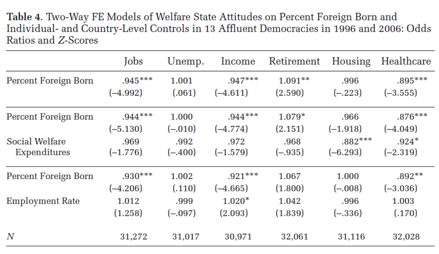
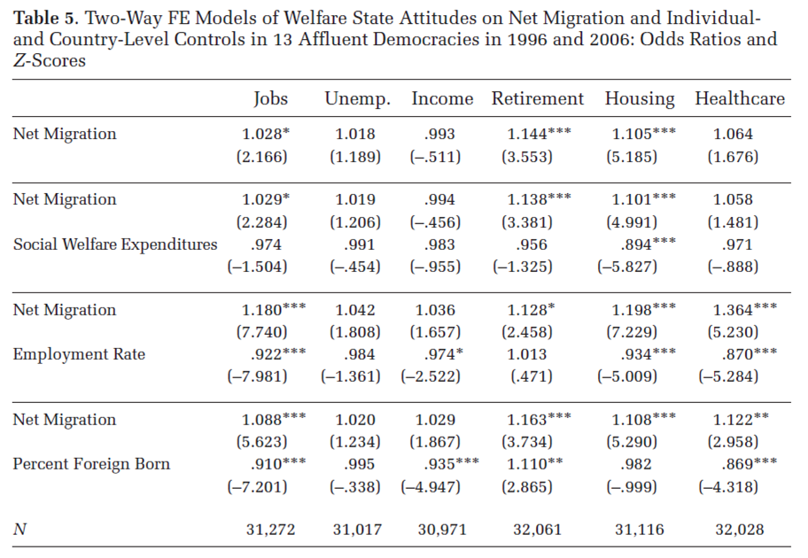

This project uses data from the Crowdsourced Replication Initiative ([CRI](https://osf.io/preprints/socarxiv/6j9qb/)). This represents the first stage where researcher participants were asked to computationally replicate the numerical findings from a study by Brady and Finnigan ([2014](https://doi.org/10.1177/0003122413513022)). The teams consisted of 1-3 members and were randomly divided into two groups,  one with the original study,  paper and code ('transparent group') and the other with only a anonymized methods section, no knowledge of the original study (or link to it in their work) and no code ('opaque group'). 

*Datafiles needed*

| File | Description |
|------|-------------|
| cristageone.xlsx | Results of the CRI in raw format; odd-ratios, significance and deviance from original,  as the teams submitted them |
| cristageone.cur1.xlsx | Results after code curation |
| cri_survey_wide_public_nolabs.dta | Survey of the replicators, with anonymized team numbers |
| teamsize.csv | Datafile containing teamsize and primary software used |
| qual_out.csv | Qualitative categories extracted from teams' workflows |


```{r setup, warning = F, message = F}

rm(list = ls())
library(pacman)

pacman::p_load("readstata13", "dplyr", "readr", "lattice", "tidyr", "readxl", "knitr", "boot", "ragg", "kableExtra", "lavaan", "lavaanPlot")

#Column no missing function
completeFun <- function(data,  desiredCols) {
  completeVec <- complete.cases(data[,  desiredCols])
  return(data[completeVec,  ])
}


```

## Load Data

### Replication Results

Two teams submitted two different result sets,  therefore,  we need to give them unique team identifiers for the analysis phase. Although these are obvious errors, we wanted to preserve the ecological validity of the teams' research processes, and did not intervene or ask them to adjust their results post hoc.


```{r rep_data}

cri <- read_xlsx(here::here("data","cristageone.xlsx"))
cri_cur <- read_xlsx(here::here("data","cristageone.cur1.xlsx"))

cri$u_teamid <- cri$`Team ID` 
cri_cur$u_teamid <- cri_cur$`Team ID`

# unique IDs for two-result teams
cri <- cri %>%
  mutate(u_teamid2 = ifelse(u_teamid == 59 & (u_teamid - lag(u_teamid,  n = 1L)) == 0,  591,  u_teamid), 
         u_teamid2 = ifelse(u_teamid == 81 & (u_teamid - lag(u_teamid,  n = 1L)) == 0,  8101,  u_teamid2))

cri_cur <- cri_cur %>%
  mutate(u_teamid2 = ifelse(u_teamid == 59 & (u_teamid - lag(u_teamid,  n = 1L)) == 0,  591,  u_teamid), 
         u_teamid2 = ifelse(u_teamid == 81 & (u_teamid - lag(u_teamid,  n = 1L)) == 0,  8101,  u_teamid2))


```


### Participant Survey

An anonymized version of this survey is cleaned and available for public use here:

Breznau, Nate, Eike Mark Rinke, and Alexander Wuttke. [2021](https://doi.org/10.7910/DVN/UUP8CX). “The Crowdsourced Replication Initiative Participant Survey.” Harvard Dataverse.

The current workflow included a version of the survey that preceded the public use file. Moreover, we made efforts to anonymize the participants, thus team numbers and range of variables are different. 

The following Stata file and its dependent SPSS files (the original survey data) were necessary to complete this routine, but the files used to create the following are not-anonymous so they are not shared. 

"cri_survey_wide_public_nolabs.dta" 

This was created from the following:

Required code files:
  master.do
      convert spss.do
      merge_waves.do
      recode.do
  Cri_spec.do

Required SPSS data files:
  W1_export.sav
  W2_export.sav
  W3_export.sav
  W4_export.sav
  

Note that teams are in wide format, so that each variable has up to three values depending on the number of team members. 


```{r survey,  warning=F,  message=F }

# datafile merged into within-team wide format

cri2 <- readstata13::read.dta13(here::here("data","cri_survey_wide_public_nolabs.dta"))

```


## Measurement of Variables

Team maximum used for statistics skills and mean for difficulty of replication. The logic is that as long as each team member took part in production of the final product, the one with the highest skills might have the highest likelihood of influencing team decisions; if not, this at least gives a maximum possible source of skill influence. Whereas, with difficulty we expected that as long as all team members took part or were assigned tasks, that if it was difficult they might have been more likely to commit errors.


```{r recodes,  warning=F,  message=F}

#Generate team-specific qualities

cri2 <- cri2 %>%
  rowwise() %>%
      mutate(stat3 = -1*(max(v_341,  v_342,  v_343,  na.rm = T)),  #higher is less dificult replication
             stat4 = mean(c(backgr_exp_teach_stat1,  backgr_exp_teach_stat2,  backgr_exp_teach_stat3),  na.rm = T),  #higher more courses taught
             stat5 = mean(c(backgr_exp_famil_mlm1,  backgr_exp_famil_mlm2,  backgr_exp_famil_mlm3),  na.rm = T),  #higher more MLM familiarity
             stat6 = mean(c(v_181,  v_182,  v_183),  na.rm = T),  #higher is more stat publications
             stat7 = mean(c(v_211,  v_212,  v_213),  na.rm = T), #higher is more MLM publications
             degree = ifelse(backgr_degree1 == 3, 1, ifelse(backgr_degree1 == 4, 2, 3)),
             degree2 = ifelse(backgr_degree2 == 3, 1, ifelse(backgr_degree2 == 4, 2, 3)),
             degree = ifelse(is.na(backgr_degree1) | backgr_degree1 == 7, degree2, degree))

cri2$degree <- as.numeric(ifelse(is.na(cri2$degree), 3, cri2$degree)) # 1 Soc 2 Poli Sci 3 Other

# quick info on how many teams have consistent background degrees
cri2 <- cri2 %>%
  mutate(degree_consist = ifelse(degree == degree2, 1, 0),
         degree_consist = ifelse(is.na(degree2), 1, degree_consist),
         degree_consist = ifelse(backgr_degree1 == backgr_degree3 & !is.na(backgr_degree3), 1, degree_consist),
         degree_consist = ifelse(is.na(backgr_degree1) & !is.na(backgr_degree3), 1, degree_consist))

# replace -Inf values with NA

cri2 <- cri2 %>%
  ungroup() %>%
  mutate(stat3 = ifelse(stat3 == "Inf",  NA,  stat3), 
         stat4 = ifelse(stat4 == "-Inf" | stat4 == "NaN",  NA,  stat4), 
         stat5 = ifelse(stat5 == "-Inf" | stat5 == "NaN",  NA,  stat5), 
         stat6 = ifelse(stat6 == "-Inf" | stat6 == "NaN",  NA,  stat6), 
         stat7 = ifelse(stat7 == "-Inf" | stat7 == "NaN",  NA,  stat7)) %>%
  select(-c(degree2))

# impute a few missing values
imp <- lm(stat3 ~ stat4 + stat5 + stat6 + stat7, data = cri2)

cri2$stat3i <- round(predict.lm(imp, newdata = cri2),0)

cri2$stat3 <- ifelse(is.na(cri2$stat3), cri2$stat3i, cri2$stat3)

cri2 <- select(cri2, -c(stat3i))

```

### Confirmatory Factor Analysis

```{r measure}
m1 <- ' difficult =~  stat3
        stat_skill =~ stat4 + stat5 + stat6 + stat7
        difficult ~~ stat_skill '

cri2_nomis <- completeFun(cri2,  c("stat3", "stat4", "stat7"))

cfa <- cfa(m1,  data = cri2_nomis)

preds <- as.data.frame(lavaan::lavPredict(cfa,  newdata = cri2_nomis))

cri2_nomis <- cbind(cri2_nomis,  preds)

cri2_nomis <- select(cri2_nomis,  u_teamid,  difficult,  stat_skill)

cri2 <- left_join(cri2,  cri2_nomis,  by = "u_teamid")

# mean replacement (don't use, too risky)

# cri2 <- cri2 %>%
#  mutate(difficult = ifelse(is.na(difficult),  mean(difficult,  na.rm = T),  difficult), 
#         stat_skill = ifelse(is.na(stat_skill),  mean(stat_skill,  na.rm = T),  stat_skill))

rm(cri2_nomis,  preds,  cfa)

```


## Merge Data

```{r merge_two}

# teamsize unfortunately not in these data, add it here
teamsize <- read.csv(file = here::here("data","teamsize.csv"),  header = T)

cri2 <- left_join(cri2,  teamsize,  by = "u_teamid")

# select only needed vars

cri2 <- dplyr::select(cri2,  u_teamid,  u_expgroup1,  backgr_degree1, backgr_degree2, backgr_degree3,  numinteam,  software_final_models,  degree, difficult,  stat_skill, degree_consist)


# add instances of routine researcher variability
routine <- read.csv(file = here::here("data", "routine_var.csv"), header = F)

colnames(routine) <- c("routine","u_teamid")
routine$routine <- as.numeric("1")


cri2 <- left_join(cri2, routine, by = "u_teamid")
cri2$routine <- ifelse(is.na(cri2$routine), 0, cri2$routine)

cri <- left_join(cri,  cri2,  by = "u_teamid")

cri_cur <- left_join(cri_cur,  cri2,  by = "u_teamid") 

# check number of consistent degrees in our relevant sample
sum(cri$degree_consist, na.rm = T)

cri <- cri %>%
  select(-degree_consist)

cri_cur <- cri_cur %>%
  select(-degree_consist)

rm(teamsize,  routine, cri2)

```

## Prepare Replication Results

### Original Results

It is necessary to convert them into long format for plotting and analysis. Also, note that u_teamid2 keeps the two teams that submitted separate analyses by wave as distinct teams for now (team 59 and 81). If users want to identify which effects are replications of which odd-ratios and NHST tests, labels are in the file [variable_labels.R](../code/variable_labels.R). The following are the original results from Brady and Finnigan (2014:32-33), Tables 4 and 5. 






### Crowdsourced Replication Results

```{r results}

columns <- c("x", "Exp1", "oa10", "s10", "dif10", "oa20", "s20", "dif20", "oa30", "s30", "dif30", "oa40", "s40", "dif40", "oa50", "s50", "dif50", "oa55", "s55", "dif55", "oa60", "s60", "dif60", "oa65", "s65", "dif65", "oa70", "s70", "dif70", "oa75", "s75", "dif75", "oa80", "s80", "dif80", "oa85", "s85", "dif85", "oa90", "s90", "dif90", "oa97", "s97", "dif97", "oa100", "s100", "dif100", "oa107", "s107", "dif107", "oa110", "s110", "dif110", "oa117", "s117", "dif117", "oa120", "s120", "dif120", "oa127", "s127", "dif127", "oa131", "s131", "dif131", "oa141", "s141", "dif141", "oa151", "s151", "dif151", "oa161", "s161", "dif161", "oa175", "s175", "dif175", "oa171", "s171", "dif171", "oa185", "s185", "dif185", "oa181", "s181", "dif181", "oa195", "s195", "dif195", "oa191", "s191", "dif191", "oa205", "s205", "dif205", "oa201", "s201", "dif201", "oa217", "s217", "dif217", "oa211", "s211", "dif211", "oa227", "s227", "dif227", "oa221", "s221", "dif221", "oa237", "s237", "dif237", "oa231", "s231", "dif231", "oa247", "s247", "dif247", "oa241", "s241", "dif241", "oa400", "s400", "dif400", "oa401", "s401", "dif401", "oa390", "s390", "dif390", "oa391", "s391", "dif391", "oa380", "s380", "dif380", "oa381", "s381", "dif381", "oa370", "s370", "dif370", "oa371", "s371", "dif371", "u_teamid", "u_teamid2", "u_expgroup1", "backgr_degree1", "backgr_degree2", "backgr_degree3", "numinteam", "software_final_models", "degree", "difficult", "stat_skill","routine")

colnames(cri) <- columns
colnames(cri_cur) <- columns

# from wide to long
cri_long <- reshape(as.data.frame(cri), varying = c("oa10", "s10", "dif10", "oa20", "s20", "dif20", "oa30", "s30",  "dif30", "oa40", "s40", "dif40", "oa50", "s50", "dif50", "oa55", "s55", "dif55", "oa60", "s60", "dif60", "oa65", "s65", "dif65", "oa70", "s70", "dif70", "oa75", "s75", "dif75", "oa80", "s80", "dif80", "oa85", "s85", "dif85", "oa90", "s90", "dif90", "oa97", "s97", "dif97", "oa100", "s100", "dif100", "oa107", "s107", "dif107", "oa110", "s110", "dif110", "oa117", "s117", "dif117", "oa120", "s120", "dif120", "oa127", "s127", "dif127", "oa131", "s131", "dif131", "oa141", "s141", "dif141", "oa151", "s151", "dif151", "oa161", "s161", "dif161", "oa175", "s175", "dif175", "oa171", "s171", "dif171", "oa185", "s185", "dif185", "oa181", "s181", "dif181", "oa195", "s195", "dif195", "oa191", "s191", "dif191", "oa205", "s205", "dif205", "oa201", "s201", "dif201", "oa217", "s217", "dif217", "oa211", "s211", "dif211", "oa227", "s227", "dif227", "oa221", "s221", "dif221", "oa237", "s237", "dif237", "oa231", "s231", "dif231", "oa247", "s247", "dif247", "oa241", "s241", "dif241", "oa400", "s400", "dif400", "oa401", "s401", "dif401", "oa390", "s390", "dif390", "oa391", "s391", "dif391", "oa380", "s380", "dif380", "oa381", "s381", "dif381", "oa370", "s370", "dif370", "oa371", "s371", "dif371"),  
                    idvar = "u_teamid2",  
                    direction = "long",  
                    v.names = c("oa","s","dif"),
                    sep = "")

cri_cur_long <- reshape(as.data.frame(cri_cur), varying = c("oa10", "s10", "dif10", "oa20", "s20", "dif20", "oa30", "s30",  "dif30", "oa40", "s40", "dif40", "oa50", "s50", "dif50", "oa55", "s55", "dif55", "oa60", "s60", "dif60", "oa65", "s65", "dif65", "oa70", "s70", "dif70", "oa75", "s75", "dif75", "oa80", "s80", "dif80", "oa85", "s85", "dif85", "oa90", "s90", "dif90", "oa97", "s97", "dif97", "oa100", "s100", "dif100", "oa107", "s107", "dif107", "oa110", "s110", "dif110", "oa117", "s117", "dif117", "oa120", "s120", "dif120", "oa127", "s127", "dif127", "oa131", "s131", "dif131", "oa141", "s141", "dif141", "oa151", "s151", "dif151", "oa161", "s161", "dif161", "oa175", "s175", "dif175", "oa171", "s171", "dif171", "oa185", "s185", "dif185", "oa181", "s181", "dif181", "oa195", "s195", "dif195", "oa191", "s191", "dif191", "oa205", "s205", "dif205", "oa201", "s201", "dif201", "oa217", "s217", "dif217", "oa211", "s211", "dif211", "oa227", "s227", "dif227", "oa221", "s221", "dif221", "oa237", "s237", "dif237", "oa231", "s231", "dif231", "oa247", "s247", "dif247", "oa241", "s241", "dif241", "oa400", "s400", "dif400", "oa401", "s401", "dif401", "oa390", "s390", "dif390", "oa391", "s391", "dif391", "oa380", "s380", "dif380", "oa381", "s381", "dif381", "oa370", "s370", "dif370", "oa371", "s371", "dif371"),  
                    idvar = "u_teamid2",  
                    direction = "long",
                    v.names = c("oa","s","dif"),
                    sep = "")

rm(columns)
```

### Long form

```{r final_clean, warning = F}
# gen DVs

# update colnames

colnames(cri_long) <- c("x","Exp1","u_teamid","u_teamid2","u_expgroup1","backgr_degree1","backgr_degree2","backgr_degree3","numinteam","software", "degree", "difficult","stat_skill", "routine", "dv_tag", "deviance","or","sig")
colnames(cri_cur_long) <- c("x","Exp1","u_teamid","u_teamid2","u_expgroup1","backgr_degree1","backgr_degree2","backgr_degree3","numinteam","software","degree", "difficult","stat_skill", "routine", "dv_tag", "deviance", "or","sig")

# make original study a value in each row

cri_long_orig <- subset(cri_long, u_teamid2 == 200 | u_teamid2 == 300)


cri_long_orig <- select(cri_long_orig, Exp1, dv_tag, or, sig)


colnames(cri_long_orig) <- c("Exp1","dv_tag","orig_or","orig_sig")


cri_long <- left_join(cri_long, cri_long_orig, by = c("dv_tag","Exp1"))

cri_cur_long <- left_join(cri_cur_long, cri_long_orig, by = c("dv_tag","Exp1"))

## make ORs numeric

cri_long <- cri_long %>%
  mutate(or = round(as.numeric(or),3),
         orig_or = round(as.numeric(orig_or),3))

cri_cur_long <- cri_cur_long %>%
  mutate(or = round(as.numeric(or),3),
         orig_or = round(as.numeric(orig_or),3))


rm(cri_long_orig)
```

## Correcting Odds Ratio Asymmetry

Odds ratios are not symmetric around the value 1. An odds ratio of 2 is identical in size as an odds ratio of 0.5 (on is 2 times more and the other is 2 times less than 1). Therefore, for comparability we need to convert the odds ratios of replication results. 

For replication purposes, we make "1"  equal to the original result, this shifts the odds ratio scale so that we now measure replication results in terms of magnitude larger or magnitude smaller. For example, if an original result is 1.5 OR, and two replicators come to the results 0.75 and 3.0 respectively, we need to divide the original by the former and then multiply by -1 (and all other replication values less than the original in all other cases) (1.5/0.75=2*-1= -2), and we need to alternatively divide the replication results of the latter (and all replication results that are higher than the original by the original) (3.0/1.5=2). This means these replicators are equivalent in their distance from the original, but in opposite directions. Simple subtraction would lead to asymmetric results (1.5-0.75=0.75 & 1.5-3.0=-1.50).

### Correct Zeros

The problem with the ratio approach is that four results reported in the replications were 0.000 at the third decimal place. Division with zero is of course not possible. For these cases we recode them to 0.001.

Additionally, some teams reported coefficients instead of odds ratios. This meant that there were negative numbers reported as 'odds ratios', this of course does not work, so these have to be recoded to 0.001 (the smallest possible at this level of precision).

```{r fixzeros, warning = F}
cri_long <- cri_long %>%
  mutate(or = case_when(
    or <= 0.000 ~ 0.001,
    .default = or
  ))

cri_cur_long <- cri_cur_long %>%
  mutate(or = case_when(
    or <= 0.000 ~ 0.001,
    .default = or
  ))  
```

### Make Deviance as Ratio

This creates a symmetric measure that is equivalent for replication values above or below the original

```{r ratio, warning = F}

cri_long <- cri_long %>%
  mutate(deviance_ratio = case_when(
         or > orig_or ~ (or/orig_or)-1,
         or < orig_or ~ (orig_or/or*-1)+1,
         .default = 0.000)
  )

cri_cur_long <- cri_cur_long %>%
  mutate(deviance_ratio = case_when(
         or > orig_or ~ (or/orig_or)-1,
         or < orig_or ~ (orig_or/or*-1)+1,
         .default = 0.000)
  )

```
## Create Replication Measures

We have three variables to measure 'verification'

|Metric|Definition|Measure|
|------|----------|---------|
|*Verification* (verif)| The direction of the regression coefficient is the same as the original| pos/pos or neg/neg = 1, or both ns diff from zero = 1|
|*Exact Replication* (exact)|The ratio of the replication odds ratio to the original is within a 1% margin (i.e., within 0.01 decimal places)|1=exact, 0=not|
|*Replication Error* (deviance_abs)|The absolute deviation as a ratio of the replication from the original|continuous measure starting from exact (=0) and increasing positive values|


### Verification

```{r dvs, warning = F, message = F}
# construct measure for positive or negative coefficient
cri_long <- cri_long %>%
  mutate(orig_direction = ifelse(is.na(orig_or), NA, ifelse(orig_or > 1, 1, ifelse(orig_or < 1, 2, 3))),
         rep_direction = ifelse(is.na(or), NA, ifelse(or > 1, 1, ifelse(or < 1, 2, 3))),
         verif = ifelse(is.na(orig_or), NA,ifelse(orig_direction == rep_direction, 1, 0)),
         exact = ifelse(is.na(orig_or), NA,ifelse(abs(deviance_ratio) <= 0.01, 1, 0)),
         verif = ifelse(verif == 0 & exact == 1, 1, verif), # this corrects studies that are 1.001 and 0.999 for example which would otherwise be coded wrong in exact
         verif = ifelse(verif == 0 & sig == 0 & orig_sig == 0, 1, verif)) # this corrects for studies that are close to odd-ratio of 1 (so effect of zero), but in both original and replication are insignificant, meaning that it is a verification (roughly zero & ns in both cases)

# construct measure for positive or negative coefficient
cri_cur_long <- cri_cur_long %>%
  mutate(orig_direction = ifelse(is.na(orig_or), NA, ifelse(orig_or > 1, 1, ifelse(orig_or < 1, 2, 3))),
         rep_direction = ifelse(is.na(or), NA, ifelse(or > 1, 1, ifelse(or < 1, 2, 3))),
         verif = ifelse(is.na(orig_or), NA, ifelse(orig_direction == rep_direction, 1, 0)),
         exact = ifelse(is.na(orig_or), NA, ifelse(abs(deviance_ratio) <= 0.01, 1, 0)),
         verif = ifelse(verif == 0 & exact == 1, 1, verif),
         verif = ifelse(verif == 0 & sig == 0 & orig_sig == 0, 1, verif))
```

### Exact replication

One reviewer questioned if the <0.01 cutoff included a similar p-value test, as with the 'verification' measure. We test this quickly here.

```{r exact_sig_test}
cri_long <- cri_long %>%
  mutate(test_sig_exact = ifelse(sig - orig_sig == 0 & exact == 1, 1, 0))

a <- sum(cri_long$test_sig_exact, na.rm = T)
b <- sum(cri_long$exact, na.rm = T)


```

### Remove Missing

```{r absdev}
# remove teams without results

cri_long <- completeFun(cri_long, "or")
cri_cur_long <- completeFun(cri_cur_long, "or")
```

### Replication Error

Some of the results lead to outlandish ratio scores of 1000 times difference or more, mostly because of two teams reporting coefficients instead of odds ratios. This gets fixed in the trimmed and curated versions, but not here. This creates a huge outlier bias in the regressions. Therefore, we trim at ratios of 50 in either direction. 

```{r reperror}
#create replication error

cri_long <- cri_long %>%
  mutate(deviance_abs = abs(deviance_ratio),
         deviance_abs = case_when(
           deviance_abs >=50 ~ 50,
           deviance_abs < 50 ~ deviance_abs,
         ))

cri_cur_long <- cri_cur_long %>%
  mutate(deviance_abs = abs(deviance_ratio),
         deviance_abs = case_when(
           deviance_abs >=50 ~ 50,
           deviance_abs < 50 ~ deviance_abs,
         ))

cri_long <- cri_long[order(cri_long$Exp1,cri_long$deviance_abs),]

cri_cur_long <- cri_cur_long[order(cri_cur_long$Exp1,cri_cur_long$deviance_abs),]

cri_long <- cri_long %>%
  group_by(Exp1) %>%
  mutate(count = row_number(),
         count = count/1000,
         max = max(count, na.rm = T),
         max1 = ifelse(Exp1 == 1, max, NA))

cri_cur_long <- cri_cur_long %>%
  group_by(Exp1) %>%
  mutate(count = row_number(),
         count = count/1000,
         max = max(count, na.rm = T),
         max1 = ifelse(Exp1 == 1, max, NA))

# make highest count value equal in both groups
cri_long <- cri_long %>%
  mutate(Exp1 = as.factor(Exp1),
         max1 = max(cri_long$max1, na.rm=T),
         max = max(cri_long$max, na.rm=T),
         count = ifelse(Exp1 == 1, round((max/max1)*count,3), count))
         
cri_cur_long <- cri_cur_long %>%
  mutate(Exp1 = as.factor(Exp1),
         max1 = max(cri_long$max1, na.rm=T),
         max = max(cri_long$max, na.rm=T),
         count = ifelse(Exp1 == 1, round((max/max1)*count,3), count))
```

### Cleaning

```{r clean}
# relevel to have transparent group first

cri_long$Exp1 <- relevel(cri_long$Exp1, "1")
cri_cur_long$Exp1 <- relevel(cri_cur_long$Exp1, "1")


# create an in sample code (without original study and with non-convergence removed)
cri_long$insamp <- ifelse(cri_long$u_teamid == 200 | cri_long$u_teamid == 300, NA, 1)
cri_long$insamp <- ifelse(cri_long$or == "speci", NA, cri_long$insamp)

cri_cur_long$insamp <- ifelse(cri_cur_long$u_teamid == 200 | cri_cur_long$u_teamid == 300, NA, 1)
cri_cur_long$insamp <- ifelse(cri_cur_long$or == "speci", NA, cri_cur_long$insamp)

# stats background

cri_long <- cri_long %>%
  mutate(backgr_degree2 = ifelse(is.na(backgr_degree2), 6, backgr_degree2),
         backgr_degree3 = ifelse(is.na(backgr_degree3), 6, backgr_degree3),
         stat_degree = ifelse(backgr_degree1 == 7, 1, ifelse(backgr_degree2 == 7, 1, ifelse(backgr_degree3 == 7, 1, 0))))
         
cri_cur_long <- cri_cur_long %>%
  mutate(backgr_degree2 = ifelse(is.na(backgr_degree2), 6, backgr_degree2),
         backgr_degree3 = ifelse(is.na(backgr_degree3), 6, backgr_degree3),
         stat_degree = ifelse(backgr_degree1 == 7, 1, ifelse(backgr_degree2 == 7, 1, ifelse(backgr_degree3 == 7, 1, 0))))         
         


# stata dummy

cri_long$stata <- ifelse(cri_long$software == "Stata", 1, 0)
cri_cur_long$stata <- ifelse(cri_cur_long$software == "Stata", 1, 0)

#remove original study from data
cri_long <- subset(cri_long, insamp == 1)
cri_cur_long <- subset(cri_cur_long, insamp == 1)

# Team 33 missing data on stat degree, code to 0
cri_cur_long$stat_degree <- ifelse(is.na(cri_cur_long$stat_degree), 0, cri_cur_long$stat_degree)

# Make soc degree variable (versus Poli Sci and Other)
cri_cur_long$degree_soc <- ifelse(is.na(cri_cur_long$degree), 3, cri_cur_long$degree)

cri_cur_long$degree_soc <- ifelse(cri_cur_long$degree_soc == 1, 1, 0)

cri_long$degree_soc <- ifelse(is.na(cri_long$degree), 3, cri_long$degree)

cri_long$degree_soc <- ifelse(cri_long$degree_soc == 1, 1, 0)


```

## Combine Qualitative Categories

```{r qualdat}
qual_out <- read.csv(here::here("results", "qual_out.csv"))
qual_out <- qual_out %>%
  rename(u_teamid2 = Team) # to get unique matches (no repeats)

cri <- cri %>%
  left_join(qual_out, by = "u_teamid2")
```

## Optional Variable Labels

See variable_labels.R to set up haven labels (and export to Stata if desired)

## Save Data

```{r save}
save.image(file = here::here("data","data.Rdata"))
```

## Colophon

```{r colophon, echo=FALSE}
sessionInfo()
```